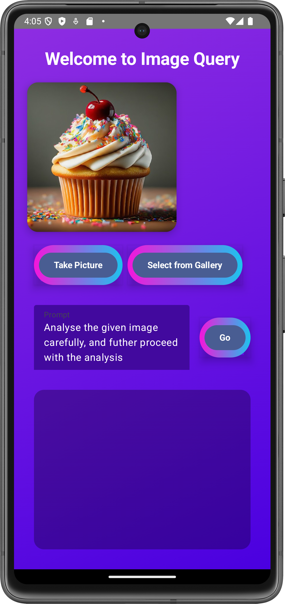
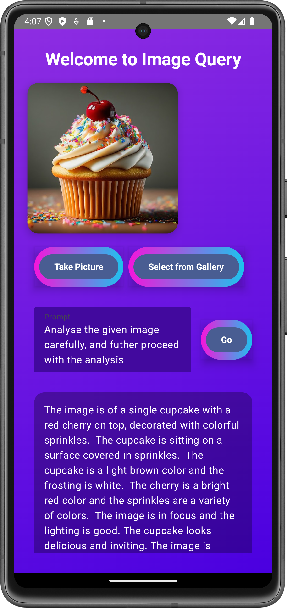

# AI Image Query App

## Project Overview

The AI Image Query App is a dynamic Android application designed to enhance image search capabilities by leveraging machine learning and image processing. The app allows users to capture or select any image and generate descriptive prompts using a state-of-the-art AI model. Users can also interact with predefined images and receive contextual information based on their selections.

## Features

- **Image Selection and Capture**: Users can either capture new images using the device camera or select existing images from the gallery.
- **AI Integration**: The app uses an AI model to generate descriptive prompts and retrieve relevant information based on the selected images.
- **Animated UI**: The user interface features animations and a modern design with gradients and shadows to provide an engaging user experience.
- **Customizable Appearance**: The UI includes options for customizing the appearance of text fields and buttons with various colors and animations.

## Screenshots




## Installation

To get started with the AI Image Query App, follow these steps:

1. **Clone the Repository**

    ```bash
    git clone https://github.com/i-soumya18/Image_Query_AndroidApp.git
    cd Image_Query_AndroidApp
    ```

2. **Open the Project**

    Open the project in Android Studio.

3. **Build and Run**

    - Ensure you have an Android device or emulator running.
    - Build and run the application from Android Studio.

## Dependencies

- Kotlin
- Jetpack Compose
- AndroidX
- Gemini Ai

## Usage

1. **Capture or Select an Image**

    Use the provided buttons to either take a new picture or select an image from your gallery.

2. **Enter a Prompt**

    Type a descriptive prompt related to the image you are working with.

3. **Generate Results**

    Press the "Generate" button to send the image and prompt to the AI model and receive the results.

## Contributing

Contributions are welcome! If you would like to contribute to this project, please fork the repository and submit a pull request with your changes. Ensure that your contributions adhere to the project's coding standards and include appropriate tests.

## Contact

For any inquiries, please visit [soumyaranjansahoo.tech](https://i-soumya18.github.io/).

---
